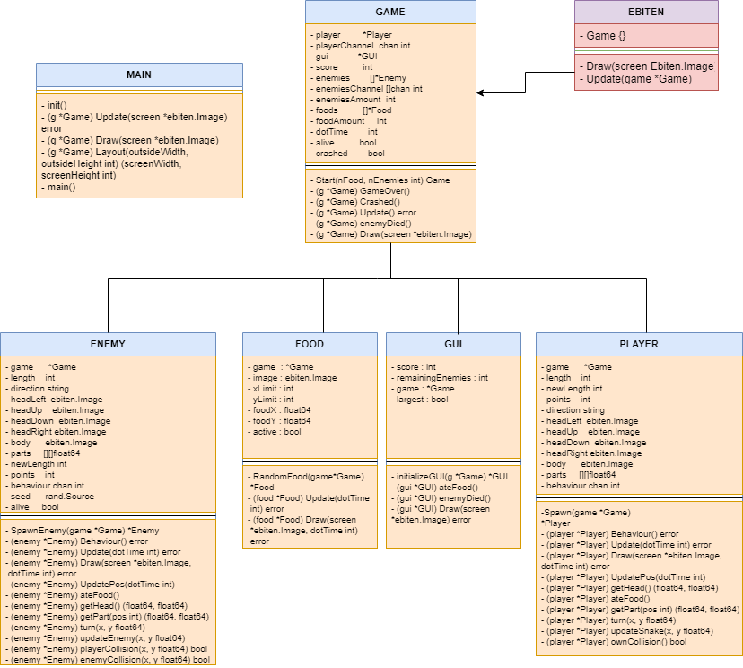

# Snake

The game Snake controls a player in this case a snake whose objective is to collect the food that is on the board, as it collects these objectives it grows, increasing its score. We have enemies that can also collect the objectives, in order to beat player one.

We have the same functionality of collision between players that would cause a game over.

Likewise, player one could eliminate the enemy snakes.

The game has conditions to win, being these when collecting all the food that is in the game or eliminating the enemy snakes.

## Architecture
**Ebiten library**

We used a 2D golang library called Ebiten for having easy methods for which we can developed this snake game, like being able to draw images in our screen at certain positions, drawing text in it and multiple 2D tools that can help with game development in golang.

**Ebiten Game Design**

Ebiten uses a certain interface which works as the main structure in which your games is going to be based, which is Ebiten.Game, this implements three methods, which are:
* **Update**: All actions that need to occur in your class happen here, like updating your player's position, life, or score, it is updated every frame.
* **Draw**: This can render whatever you want into your screen, like image files.
* **Layout**: Self-explanatory, this defines the layout your game will have.

### Game Structure
We organize the project into three main folders and the `main.go` file: 

* root 
    * elements/
    * files/
    * main.go

The `elements/` folder is the most important one, this is where the game logic resides. The main entities needed for the game are:
* Game [game.go](https://github.com/JDanielRC/Snakes/tree/main/snakes/elements/game.go)
* Player [player.go](https://github.com/JDanielRC/Snakes/tree/main/snakes/elementssnake.go)
* Food [food.go](https://github.com/JDanielRC/Snakes/tree/main/snakes/elements/food.go)
* Enemy (instances of snake) [enemy.go](https://github.com/JDanielRC/Snakes/tree/main/snakes/elements/enemy.go)
* Gui [gui.go](https://github.com/JDanielRC/Snakes/tree/main/snakes/elements/gui.go)

`game.go` will have all `ebiten.Game` interface methods implemented for the basic structure of the window of the game as well for other various settings the game will have.

We separeted our files to mimic the elements of the game. `player.go` contains all the methods and variabels that the main snake needs in order to funtions properly.

* Taking arrow keys as input at a certain predefined velocity and keeping certain constrains, such as making the snake not going to the oposite direction in which is going.

* Keeping track of the length of the snake, and calling the apropriate method when a food tile is touched, so that the food tile disappears and the length of the snake incrementes

* Also the collision with enemy snakes and the boundries of the game are check here, and if the main snake touches any of these, it will be Game Over

Similar approaches where made to the following files:

* `food.go` contains all the functionality of the food tiles, it takes the CLI arguments in order to produce that quantity of food tiles in random x axis and random y axis. and also select which of the 3 images will show.

* `gui.go` is a small file that its main function is to draw, using the ebiten api, the score, and the win or lose texts.

* `enemy.go` is a similar file to the player, as they have almost the same behaviour, except the enemies move randomly across the map, detect the boundries of the game and make changes direction accordingly to avoid collission, and, equally as food, takes de CLI arguments to reproduce the number of enemies.

As we know, we need to implement the `Game` interface. This is done in `main.go` for simplicity reasons, but inside `game.go` we will code the functionality of the structure.

When the snake eat adquired size at the end, also the snake can not move in two different directions, only can move to up, down, left, right, using the keyboard.
We have two differents endings, one is when the snake crash in the limits of the map, or when an enemy attack him. 
We have a system of point, when a snake eat one food adquired one point also the enemy snakes can take it this point to make the player one lose.

### Concurrency

We will implement a thread-safe version of the game, since ebiten library makes everything happen inside their Update method, we can create channels that can communicate with each snakes including the player.
